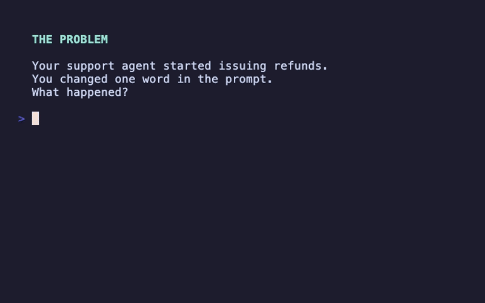

# Work Ledger

> Agent broke after a change? **Record. Replay. Diff.** Find out why.

[](https://opensource.org/licenses/MIT)
[](https://www.python.org/downloads/)



## The Problem

You changed the model. Or the prompt. Or the retrieval strategy. Now your agent behaves differently and you have no idea why.

- *"It was working yesterday, what happened?"*
- *"Which step is producing wrong output?"*
- *"I can't reproduce the bug from production"*

Your logs say the agent ran. They don't say *what it decided* or *why*.

## Install

```bash
pip install work-ledger
```

## 30-Second Example

```python
from work_ledger import WorkLedger

ledger = WorkLedger(store="./runs")

# Record a run
with ledger.run(name="my-agent") as run:
    run.record_input({"query": "What's the weather?"})
    
    with run.step("llm-call", kind="model") as step:
        response = "It's sunny, 72°F"  # Your LLM call here
        step.record_output({"response": response})
    
    run.record_output({"answer": response})

# See what was recorded
print(ledger.list_runs()[0].to_dict())
```

## See the Diff

```bash
work-ledger diff ./runs <run1> <run2>
```

```
Comparing runs:
  Expected: abc123... (my-agent)
  Actual:   def456... (my-agent)

Similarity: 58.3%

Output changes:
  ~ answer: "It's sunny..." → "It's cloudy..."

Step changes:
  + retrieve-weather [retrieval]

Metric changes:
  total_tokens: 150 → 460
```

**Now you know what broke.**

## One-Line Integrations

```python
from work_ledger import WorkLedger, wrap_agent, wrap_graph, wrap_chain

ledger = WorkLedger(store="./runs")

# PydanticAI
wrapped = wrap_agent(my_agent, ledger)
result = wrapped.run_sync("Hello!")

# LangGraph  
wrapped = wrap_graph(my_graph, ledger)
result = wrapped.invoke({"messages": [...]})

# LangChain
wrapped = wrap_chain(my_chain, ledger)
result = wrapped.invoke({"question": "..."})
```

Also supports: CrewAI, LlamaIndex, OpenAI SDK, Anthropic SDK.
See [docs/integrations.md](docs/integrations.md) for details.

## Try the Samples

```bash
git clone https://github.com/metawake/work-ledger.git
cd work-ledger && pip install -e .

python samples/03_detect_regression.py  # See a diff in action
```

| Your Problem | Sample |
|--------------|--------|
| "I want to see what my agent did" | [01_basic_recording.py](samples/01_basic_recording.py) |
| "Something changed, what?" | [03_detect_regression.py](samples/03_detect_regression.py) |
| "I use PydanticAI/LangGraph/CrewAI" | [05-07_*.py](samples/) |

## Replay Without API Calls

Record once, replay forever — no API key needed:

```python
# Record (makes real API call)
wrapped = wrap_openai(client, ledger)
response = wrapped.chat.completions.create(...)
run_id = ledger.list_runs()[0].run_id

# Replay (returns saved response, no API call)
wrapped = wrap_openai(client, ledger, replay_from=run_id)
response = wrapped.chat.completions.create(...)  # Instant, free
```

Perfect for: CI/CD testing, debugging, offline development.

## CLI

```bash
work-ledger list ./runs              # List all runs
work-ledger show ./runs <run_id>     # Show run details
work-ledger diff ./runs <id1> <id2>  # Compare two runs
work-ledger replay ./runs <run_id>   # Show replay info
work-ledger list ./runs --json       # JSON output
```

## Storage

```python
# Local (default)
ledger = WorkLedger(store="./runs")

# SQLite
ledger = WorkLedger(store=SQLiteStore("./runs.db"))

# PostgreSQL, Redis, MongoDB, S3, GCS also supported
```

See [docs/storage.md](docs/storage.md) for all 8 backends.

## Testing

Work Ledger includes decorators for regression testing:

```python
from work_ledger.testing import recorded, golden, RunDiff

@recorded("fixtures/baseline.json")
def test_agent():
    result = agent.run("test")
    assert "response" in result

# Compare runs programmatically
diff = RunDiff(old_run, new_run)
assert diff.similarity > 0.95
```

See [docs/testing.md](docs/testing.md) for the full testing API.

## What It Does

| Action | What It Does |
|--------|--------------|
| **Record** | Capture every step, input, output, and decision |
| **Replay** | Re-run using saved fixtures — no API calls needed |
| **Diff** | See exactly what changed between two runs |
| **Debug** | Trace causal chains — what triggered what |

## What It Doesn't Do

- ❌ SaaS dashboard
- ❌ Replace observability tools
- ❌ Require a specific agent framework

Work Ledger is **small and composable**.

## Tested With

| Integration | Tested Version | Notes |
|-------------|----------------|-------|
| OpenAI SDK | 1.50+ | v1 API, stable |
| Anthropic SDK | 0.40+ | Pre-1.0 but stable |
| PydanticAI | 0.0.20+ | Rapidly evolving |
| LangChain | 0.2+ | Core + chains |
| LangGraph | 0.2+ | Graph execution |
| CrewAI | 0.70+ | Multi-agent |
| LlamaIndex | 0.10+ | RAG pipelines |

*Using an older version? It may still work — we use duck typing. Open an issue if you hit problems.*

## Documentation

- [Integrations](docs/integrations.md) — Framework wrappers
- [Storage](docs/storage.md) — 8 storage backends
- [Testing](docs/testing.md) — Regression testing
- [Data Model](docs/data-model.md) — Run/Step structure

## See Also

- **[Ragtune](https://github.com/metawake/ragtune)** — "EXPLAIN ANALYZE for RAG retrieval." Debug, benchmark, and tune your retrieval layer with Recall@k, MRR, and CI/CD quality gates. Work Ledger records what happened; Ragtune measures how good your retrieval is.

## Contributing

See [CONTRIBUTING.md](CONTRIBUTING.md) for guidelines.

## License

MIT — see [LICENSE](LICENSE).

---

<p align="center">
  <strong>Work Ledger</strong><br>
  <em>Because agent runs deserve to be understood, not just logged.</em>
</p>
